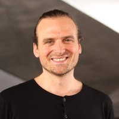

# Taller de iniciación al Creative Coding

No todo va a ser hablar del último framework, de la última metodología ágil, de la última funcionalidad añadida al último lenguaje, o de si es mejor la programación funcional que la programación orientada a objetos.

Nosotros queremos hablar de **programar de forma creativa para crear arte**. 

En este taller queremos **iniciaros en el apasionante mundo del Creative Coding**. ¿Y qué mejor que iniciarse en este mundo que remangándose las mangas y poniendo las manos delante de un teclado a programar con fines estéticos y no funcionales? :-)

## CommitConf 2019

<https://www.koliseo.com/events/commit-2019/r4p/5106829466009600/agenda#/5690945286701056/5131030767861760>

## Slides

<http://bit.ly/creative-coding-2019>

## Ejemplos

<https://asanzdiego.github.io/commit-conf-taller-p5js/circles-01-example/>

<https://asanzdiego.github.io/commit-conf-taller-p5js/circles-02-example/>

<https://asanzdiego.github.io/commit-conf-taller-p5js/circles-03-example/>

<https://asanzdiego.github.io/commit-conf-taller-p5js/lines-01-example/>

<https://asanzdiego.github.io/commit-conf-taller-p5js/lines-02-example/>

<https://asanzdiego.github.io/commit-conf-taller-p5js/lines-03-example/>

## Autores

**Adolfo Sanz De Diego**

Empecé desarrollando aplicaciones web, hasta que di el salto a la docencia. Un día me dió por crear [HackathonLovers](http://hackathonlovers.com), una comunidad de amantes de los hackathones. Actualmente soy asesor técnico en el [servicio TIC de la Dirección General de Infraestructuras y Servicios de la Consejería de Educación e Innovación](http://www.madrid.org/es/transparencia/consejeria/servicio-tecnologias-informacion-y-comunicacion) de la Comunidad de Madrid. Además colaboro puntualmente como profesor en la [Universidad de Alcalá](https://www.uah.es) y como formador especializado en tecnologías de desarrollo en [Pronoide](http://www.pronoide.com)

[twitter](https://twitter.com/asanzdiego) |
[blog](https://www.asanzdiego.com) |
[github](https://github.com/asanzdiego) |
[linkedin](https://www.linkedin.com/in/asanzdiego) |
[slideshare](https://www.slideshare.net/asanzdiego)

**Carles Gutierrez**

Programador creativo enfocado al desarrollo y la investigación de experiencias interactivas en áreas diversas tales como la visión artificial, el Arte Digital, los Videojuegos, las Visualizaciones de datos, la Realidad aumentada, el Video-mapping, o el prototipado de productos interactivos entre otros.

[twitter](https://twitter.com/carlesgutierrez) |
[web](http://carlesgutierrez.github.io/) |
[github](https://github.com/carlesgutierrez)

**Javi Aránega**

Trabajo como Creative Technologist y aunque soy ingeniero llevo años mezclando diseño, creatividad y tecnología en experiencias interactivas dentro y fuera de la pantalla para agencias de publicidad, estudios digitales y grandes corporaciones. Algunos de los clientes para los que he trabajado son RTVE, Google, 72&Sunny, B-Reel y BBVA. Actualmente aporto mi granito de arena a un equipo de Diseño de Experiencia de Usuario.

[twitter](https://twitter.com/javiaranega) |
[web](http://www.javiaranega.com) |
[github](https://github.com/jaranega) |
[linkedin](https://www.linkedin.com/in/javiaranega/)